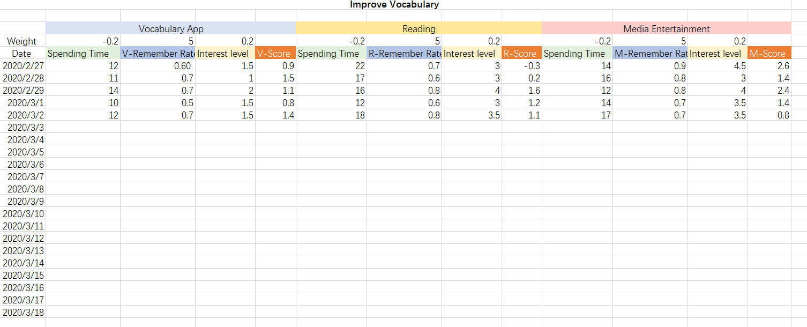
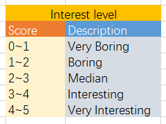

# Phase2

## 1.	Identify a subjective component of interest in your project, such as your own self's internal feeling about a thing, person, event, etc. It could also be a quality score of some kind, such as the relative strength of some output of interest, such as practice writing samples.

## 2.	Create a spreadsheet and create a scoring scale of some range of discrete vales. Name the scale something meaningful

## 3.	On a dedicated tab, generate a coding guide for each individual value such that as you use this scale to record data your reported values are all mapped to a linguistic representation of this subjective measurement.

## 4.	On a dedicated tab, create a data entry table with appropriately named columns and declared data types for each column to record the values measured using your scale.
## 5.	Add additional columns for measurements using other input devices, such as third party behavior tracking applications, inventory control systems, public data reporting agencies--i.e. weather, news.
## 6.	On a dedicated tab create a data dictionary describing each of the columns in your data gathering tool
